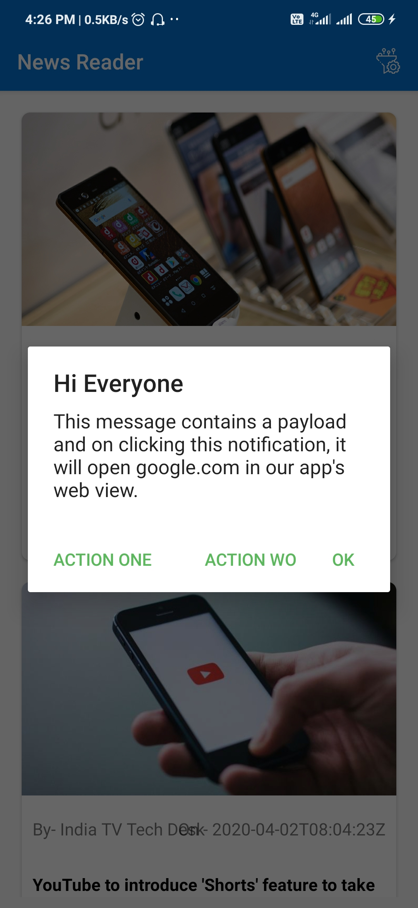

# News Reader
---

An online news reader app with these features - 

• An android app using Java.
• News feed app with country specific news from India and US
• Api from  https://newsapi.org/ and use the api key to fetch
news country wise
• The news changes depending on the user’s location. If it is India we
fetch India specific news and same with US
• When clicked on any news it opens in webview
• native ads from admob in the news feed
• firebase remote config to switch on and off the ads from console
• Onesignal sdk for push notifications. We can  send
any link through push notif, when clicked on it opens in the webview

## Screenshots
---
|||| 
|---|---|---|
|||| 
|||
---

